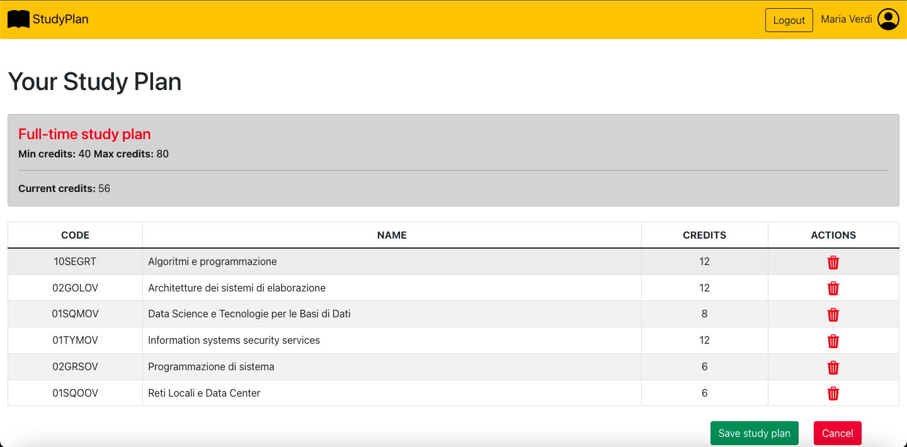
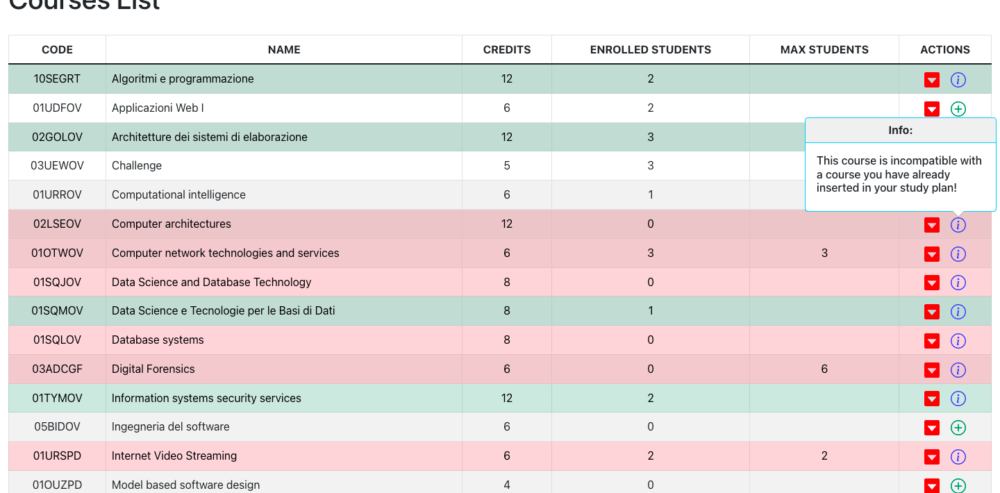
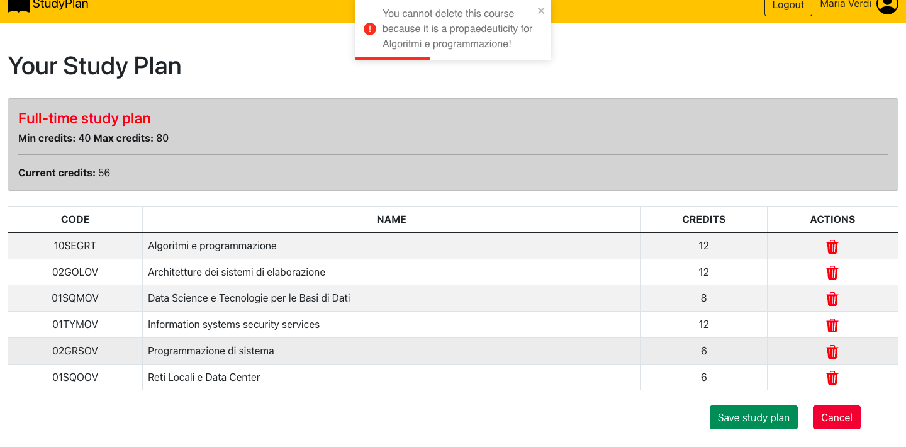
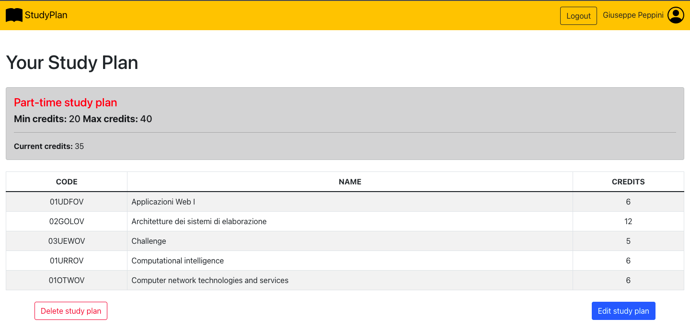
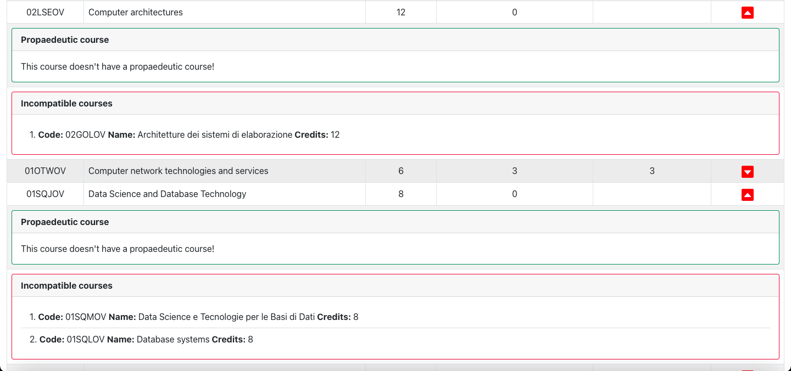

# Exam #1: "Piano degli studi"
## Student: s296247 ROSATI FRANCESCO 

[](https://sonarcloud.io/summary/new_code?id=Francesco-rosati_Esame-applicazioni-web-1) 

[](https://sonarcloud.io/summary/new_code?id=Francesco-rosati_Esame-applicazioni-web-1) [](https://sonarcloud.io/summary/new_code?id=Francesco-rosati_Esame-applicazioni-web-1) [](https://sonarcloud.io/summary/new_code?id=Francesco-rosati_Esame-applicazioni-web-1) [](https://sonarcloud.io/summary/new_code?id=Francesco-rosati_Esame-applicazioni-web-1) [](https://sonarcloud.io/summary/new_code?id=Francesco-rosati_Esame-applicazioni-web-1) [](https://sonarcloud.io/summary/new_code?id=Francesco-rosati_Esame-applicazioni-web-1)

## React Client Application Routes

- Route `/`: the route contains the Home component. Here the user (student) can see if not logged in, the complete list of courses and can create if logged in, his own study plan.
- Route `/login`: the route contains the login form, where the user (student) can authenticate himself inserting username and password.
- Route `*`:  the route contains the Error component. Here the user is redirected if a known route is not found or the route is wrong. 

## API Server

### Login

__URL:__ `/api/studentSessions`  
__Method:__ POST  
__Description:__ Performs the login  
__Request body:__ 
```
{
    "username":"u1@p.it",
    "password":"testpassword"
}
```
__Response:__ `200 Ok`  
__Response body:__ 
```
{
    "id": 1,
    "username": "u1@p.it",
    "name": "Francesco",
    "surname": "Bini"
}
```
__Error responses:__ `401 Unauthorized`

### Get current student informations

__URL:__ `/api/sessions/currentStudent`  
__Method:__ GET  
__Description:__ Retrieves the informations of the current student.  
__Request body:__ _None_  
__Response:__ `200 OK`  
__Response body:__ 
```
    {
      "id": 4,
      "username": "u4@p.it",
      "name": "Gianmarco",
      "surname": "Rossi",
      "ft": 0
    }
```
__Error responses:__ `401 Unauthorized`

### Logout

__URL:__ `/api/sessions/currentStudent`  
__Method:__ DELETE  
__Description:__ Performs the logout of the current student  
__Request body:__ _None_  
__Response:__ `200 Ok`  
__Response body:__ _None_

### Get all courses

__URL:__ `/api/courses`  
__Method:__ GET  
__Description:__ Retrieves the list of all the available courses.  
__Request body:__ _None_  
__Response:__ `200 OK`  
__Response body:__ 
```
    [
      {
          "code": "10SEGRT",
          "name": "Algoritmi e programmazione",
          "credits": 12,
          "currentStudents": 2,
          "maxStudents": null,
          "propaedeuticity": "02GRSOV"
      },
      {
          "code": "01UDFOV",
          "name": "Applicazioni Web I",
          "credits": 6,
          "currentStudents": 2,
          "maxStudents": null,
          "propaedeuticity": null
      }, ...
    ]
```
__Error responses:__ `500 Internal Server Error` 

### Get all incompatibilities

__URL:__ `/api/incompatibilities`  
__Method:__ GET  
__Description:__ Retrieves the list of all the incompatibilities between courses.  
__Request body:__ _None_  
__Response:__ `200 OK`  
__Response body:__ 
```
    [
      {
        "code": "02GOLOV",
        "incompatibleCourse": "02LSEOV"
      },
      {
        "code": "02LSEOV",
        "incompatibleCourse": "02GOLOV"
      }, ...
    ]
```
__Error responses:__ `500 Internal Server Error`

### Get student study plan

__URL:__ `/api/coursesStudent`  
__Method:__ GET  
__Description:__ Retrieves the study plan of the logged in student.  
__Request body:__ _None_  
__Response:__ `200 OK`  
__Response body:__ 
```
    "courses": [
        {
            "code": "01OTWOV",
            "name": "Computer network technologies and services",
            "credits": 6,
            "propaedeuticity": null
        },
        {
            "code": "01TYMOV",
            "name": "Information systems security services",
            "credits": 12,
            "propaedeuticity": null
        }, ...
    ],
    "type": 1
```
__Error responses:__ `401 Unauthorized`, `404 Not Found`, `500 Internal Server Error`

### New study plan

__URL:__ `/api/newCoursesStudent`  
__Method:__ POST  
__Description:__ Creates a new study plan for the logged in student  
__Request body:__ 
```
{
  "codes": [ 
      "01UDFOV", 
      "01SQJOV",
      "01URSPD", 
      "02KPNOV",
      ...
  ],
  "type": 0
}
```
__Response:__ `201 Created`  
__Response body:__ _None_  
__Error responses:__ `401 Unauthorized`, `404 Not Found`, `422 Unprocessable Entity`, `503 Service Unavailable`

### Delete the entire study plan

__URL:__ `/api/allCoursesStudent`  
__Method:__ DELETE  
__Description:__ Deletes the entire study plan of the logged in student  
__Request body:__ _None_  
__Response:__ `204 No Content`  
__Response body:__ _None_  
__Error responses:__ `401 Unauthorized`, `404 Not Found`, `503 Service Unavailable`

## Database Tables

- Table `COURSES` - contains all the courses offered by the university. 
Attributes:  **CODE, NAME, CREDITS, MAX_STUDENTS, PROPAEDEUTICITY (PRIMARY KEY: CODE)**
- Table `INCOMPATIBILITIES` - contains all the incompatibilities between courses. Attributes: **COURSE_CODE, INCOMPATIBILITY (PRIMARY KEYS: COURSE_CODE, INCOMPATIBILITY) - (FOREIGN KEYS: COURSE_CODE, INCOMPATIBILITY)**
- Table `STUDENTS` - contains all the students (users) and their type of plan. Attributes: **ID, NAME, SURNAME, USERNAME, PASSWORD, SALT, FT (PRIMARY KEY: ID)**
- Table `STUDY_PLANS` - contains all the associations between students and courses. Attributes: **CODE, ID (PRIMARY KEYS: CODE, ID) - (FOREIGN KEYS: CODE, ID)**

## Main React Components

- `Home` (in `Home.js`): this is the main component of the application and it includes the navbar, the study plan table if any and the courses table.
- `StudyPlanNavbar` (in `Navbar.js`): this is the navbar of the application, where the student can be redirected to the login page, can do the logout and can see his informations if he is logged in.
- `Courses` (in `Courses.js`): this component is in charge of showing all the courses in a specific table with the related actions and the related informations when the study plan is in edit mode.
- `CourseRow` (in `Courses.js`): this component manages all the controls (propaedeuticity, incompatibility etc.) on a specific course (row of the table) when the study plan is in edit mode.
- `StudyPlan` (in `StudyPlan.js`): this component is in charge of showing all the courses selected in the current study plan with the related actions. Here the student can create, delete a new study plan or edit an existing one. 
- `LoginPage` (in `LoginComponents.js`): this component includes the login form where the user can insert his credentials and do the login.
- `SpinnerBox` (in `SpinnerBox.js`): this component is used to manage the situation in which the server is loading the resources. It is in charge of displaying a loading spin until the server has not finished.
- `Error` (in `Error.js`): this component is used when a known route is not found. Here the student will be redirected on the main page, containing the study plan and the courses if he is logged in or the courses only if he is not logged in.

## Screenshot







## Users Credentials

| Name | Surname | Username | Password | Description |
| :--: | :-----: | :------: | :------: | :--------- |
| Francesco | Bini | `u1@p.it` | `testpassword` | student with a full-time study plan |
| Giuseppe | Peppini | `u2@p.it` | `testpassword` | student with a part-time study plan |
| Mario | Cerci | `u3@p.it` | `testpassword` | student without created study plans |
| Gianmarco | Rossi | `u4@p.it` | `testpassword` | student with a part-time study plan |
| Simone | Bianchi | `u5@p.it` | `testpassword` | student with a full-time study plan |
| Maria | Verdi | `u6@p.it` | `testpassword` | student with a full-time study plan |
